# Real-Time Fraud Detection System with Kafka Streams, InfluxDB, and Grafana

This project implements a real-time fraud detection system using Kafka Streams to process financial transactions, detect suspicious activity, store results in InfluxDB, and visualize them in Grafana.

## Features

- Processes financial transactions from the Kafka topic `transactions-input`.
- Detects suspicious transactions where the `amount` exceeds 10,000.
- Publishes suspicious transactions to the Kafka topic `fraud-alerts`.
- Stores suspicious transactions in InfluxDB for persistence.
- Displays real-time analytics on a Grafana dashboard.

---

## Architecture

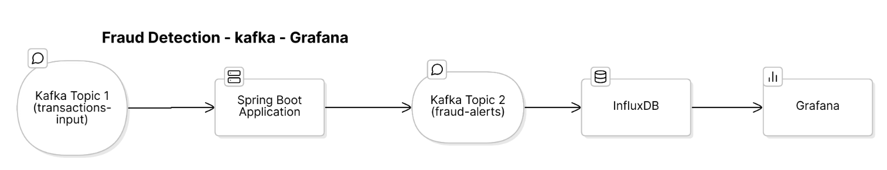

The architecture includes:
- **Kafka Streams** for processing transaction data.
- **InfluxDB** for storing suspicious transactions.
- **Grafana** for visualizing suspicious transactions in real time.

---

## Fraud Detection Rule

The system flags a transaction as suspicious if:
```plaintext
Transaction amount > 10,000
````
## Prerequisites
- Docker and Docker Compose
- Apache Kafka
- InfluxDB
- Grafana


## Installation and Setup

## Setup du cluster Kafka
````
version: '3.8'
networks:
  monitoring:
    driver: bridge
services:
  zookeeper:
    image: confluentinc/cp-zookeeper:latest
    networks:
      - monitoring
    environment:
      ZOOKEEPER_CLIENT_PORT: 2181
    ports:
      - "2181:2181"

  kafka:
    image: confluentinc/cp-kafka:latest
    networks:
      - monitoring
    depends_on:
      - zookeeper
    ports:
      - "9092:9092"
    environment:
      KAFKA_BROKER_ID: 1
      KAFKA_ZOOKEEPER_CONNECT: zookeeper:2181
      KAFKA_ADVERTISED_LISTENERS: PLAINTEXT://kafka:29092,PLAINTEXT_HOST://localhost:9092
      KAFKA_LISTENER_SECURITY_PROTOCOL_MAP: PLAINTEXT:PLAINTEXT,PLAINTEXT_HOST:PLAINTEXT
      KAFKA_INTER_BROKER_LISTENER_NAME: PLAINTEXT
      KAFKA_OFFSETS_TOPIC_REPLICATION_FACTOR: 1

  influxdb:
    image: influxdb:latest
    networks:
      - monitoring
    ports:
      - "8086:8086"
    environment:
      DOCKER_INFLUXDB_INIT_MODE: setup
      DOCKER_INFLUXDB_INIT_USERNAME: fatima
      DOCKER_INFLUXDB_INIT_PASSWORD: adminpassword
      DOCKER_INFLUXDB_INIT_ORG: zerheri
      DOCKER_INFLUXDB_INIT_BUCKET: fraud_transaction
      DOCKER_INFLUXDB_INIT_ADMIN_TOKEN: my-super-secret-token

  grafana:
    image: grafana/grafana:latest
    networks:
      - monitoring
    ports:
      - "3000:3000"
    environment:
      GF_SECURITY_ADMIN_USER: admin
      GF_SECURITY_ADMIN_PASSWORD: admin
    depends_on:
      - influxdb
    volumes:
      - grafana-data:/var/lib/grafana

volumes:
  grafana-data:
````
## Setup
### 1-  Transaction
````java
package zerheri.fatima;


import com.fasterxml.jackson.annotation.JsonProperty;

public class Transaction {
    private String userId;
    private double amount;
    private int timestamp;

    public Transaction() {}

    public Transaction(String userId, double amount, int timestamp) {
        this.userId = userId;
        this.amount = amount;
        this.timestamp = timestamp;
    }

    @JsonProperty("userId")
    /**
     * Getter for userId.
     * @JsonProperty maps this attribute to the JSON key "userId" to ensure proper serialization and deserialization.
     */
    public String getUserId() {
        return userId;
    }

    @JsonProperty("amount")
    public double getAmount() {
        return amount;
    }

    @JsonProperty("timestamp")
    public int getTimestamp() {
        return timestamp;
    }

    @Override
    public String toString() {
        return "Transaction{" +
                "userId='" + userId + '\'' +
                ", amount=" + amount +
                ", timestamp=" + timestamp +
                '}';
    }
}


````
### 2- TransactionProducer  
````java
package zerheri.fatima;


import com.fasterxml.jackson.databind.ObjectMapper;
import org.apache.kafka.clients.producer.KafkaProducer;
import org.apache.kafka.clients.producer.ProducerConfig;
import org.apache.kafka.clients.producer.ProducerRecord;
import org.apache.kafka.common.serialization.StringSerializer;

import java.util.Properties;
import java.util.Random;

public class TransactionProducer {

    // Kafka topic where transactions will be published
    private static final String TOPIC = "transactions-input";
    private static final Random RANDOM = new Random(); // Used to generate random transaction data
    private static final ObjectMapper MAPPER = new ObjectMapper(); // Used for converting objects to JSON strings

    public static void main(String[] args) {
        // Producer properties configuration
        Properties props = new Properties();
        props.put(ProducerConfig.BOOTSTRAP_SERVERS_CONFIG, "localhost:9092"); // Kafka broker address
        props.put(ProducerConfig.KEY_SERIALIZER_CLASS_CONFIG, StringSerializer.class.getName()); // Key serializer
        props.put(ProducerConfig.VALUE_SERIALIZER_CLASS_CONFIG, StringSerializer.class.getName()); // Value serializer

        // Creating a Kafka producer instance
        try (KafkaProducer<String, String> producer = new KafkaProducer<>(props)) {

            // Infinite loop to continuously produce transactions
            while (true) {
                // Generate a random transaction
                Transaction transaction = generateTransaction();

                // Convert the transaction object to JSON format
                String json = MAPPER.writeValueAsString(transaction);

                // Create a producer record with the topic, key (userId), and value (transaction JSON)
                ProducerRecord<String, String> record =
                        new ProducerRecord<>(TOPIC, transaction.getUserId(), json);

                // Send the record asynchronously
                producer.send(record, (metadata, exception) -> {
                    if (exception != null) {
                        System.err.println("Error sending message: " + exception.getMessage());
                    } else {
                        System.out.println("Sent transaction: " + json);
                    }
                });

                // Pause for 1 second before sending the next transaction
                Thread.sleep(1000);
            }

        } catch (Exception e) {
            e.printStackTrace();
        }
    }

    /**
     * Generates a random transaction for testing purposes.
     * @return A new Transaction object with random userId, amount, and timestamp.
     */
    private static Transaction generateTransaction() {
        // Generate a random user ID in the format "user_001" to "user_199"
        String userId = String.format("user_%03d", RANDOM.nextInt(200));

        // Generate a random amount between 1000 and 11000
        double amount = 1000 + RANDOM.nextDouble() * 10000;

        // Generate a timestamp in seconds (current system time)
        int timestamp = (int) (System.currentTimeMillis() / 1000);

        // Return the generated Transaction object
        return new Transaction(userId, amount, timestamp);
    }
}


````
### 3-  TransactionProcessor
````java
package zerheri.fatima;


import com.fasterxml.jackson.databind.ObjectMapper;
import org.apache.kafka.common.serialization.Serdes;
import org.apache.kafka.streams.KafkaStreams;
import org.apache.kafka.streams.StreamsBuilder;
import org.apache.kafka.streams.StreamsConfig;
import org.apache.kafka.streams.kstream.KStream;

import java.util.Properties;

public class TransactionProcessor {
    private static final String INPUT_TOPIC = "transactions-input";
    private static final String OUTPUT_TOPIC = "fraud-alerts";
    private static final double SUSPICIOUS_AMOUNT = 10_000.0;
    private static final ObjectMapper MAPPER = new ObjectMapper();

    public static void main(String[] args) {
        Properties config = new Properties();
        config.put(StreamsConfig.APPLICATION_ID_CONFIG, "transaction-processor");
        config.put(StreamsConfig.BOOTSTRAP_SERVERS_CONFIG, "localhost:9092");
        config.put(StreamsConfig.DEFAULT_KEY_SERDE_CLASS_CONFIG, Serdes.String().getClass());
        config.put(StreamsConfig.DEFAULT_VALUE_SERDE_CLASS_CONFIG, Serdes.String().getClass());

        StreamsBuilder builder = new StreamsBuilder();

        KStream<String, String> inputStream = builder.stream(INPUT_TOPIC);
        KStream<String, Transaction>[] branches = inputStream
                .mapValues(value -> {
                    try {
                        return MAPPER.readValue(value, Transaction.class);
                    } catch (Exception e) {
                        System.err.println("Error parsing transaction: " + e.getMessage());
                        return null;
                    }
                })
                .filter((key, transaction) -> transaction != null)
                .branch(
                        (key, transaction) -> transaction.getAmount() > SUSPICIOUS_AMOUNT,
                        (key, transaction) -> true
                );

        branches[0]
                .mapValues(transaction -> {
                    try {
                        return MAPPER.writeValueAsString(transaction);
                    } catch (Exception e) {
                        System.err.println("Error serializing transaction: " + e.getMessage());
                        return null;
                    }
                })
                .filter((key, json) -> json != null)
                .peek((key, json) -> System.out.println("Fraud alert: " + json))
                .to(OUTPUT_TOPIC);

        KafkaStreams streams = new KafkaStreams(builder.build(), config);
        streams.start();

        // Shutdown hook
        Runtime.getRuntime().addShutdownHook(new Thread(streams::close));
    }
}

````
### 4-Class TransactionConsumer
````java
package zerheri.fatima;


import com.fasterxml.jackson.databind.ObjectMapper;
import com.influxdb.client.InfluxDBClient;
import com.influxdb.client.InfluxDBClientFactory;
import com.influxdb.client.WriteApi;
import com.influxdb.client.domain.WritePrecision;
import com.influxdb.client.write.Point;
import org.apache.kafka.clients.consumer.ConsumerConfig;
import org.apache.kafka.clients.consumer.ConsumerRecords;
import org.apache.kafka.clients.consumer.KafkaConsumer;
import org.apache.kafka.common.serialization.StringDeserializer;

import java.io.FileInputStream;
import java.io.IOException;
import java.time.Duration;
import java.util.Collections;
import java.util.Properties;

public class TransactionConsumer {
    private static final String TOPIC = "fraud-alerts";
    private static final String INFLUXDB_ORG = "enset";
    private static final String INFLUXDB_BUCKET = "fraud_transaction";
    private static final ObjectMapper MAPPER = new ObjectMapper();

    public static void main(String[] args) {
        Properties appProps = new Properties();
        try (FileInputStream fis = new FileInputStream("src/main/resources/application.properties")) {
            appProps.load(fis);
        } catch (IOException e) {
            System.err.println("Error loading properties file: " + e.getMessage());
            return;
        }

        String INFLUXDB_URL = appProps.getProperty("influxdb.url");
        String INFLUXDB_TOKEN = appProps.getProperty("influxdb.token");
        Properties props = new Properties();
        props.put(ConsumerConfig.BOOTSTRAP_SERVERS_CONFIG, "localhost:9092");
        props.put(ConsumerConfig.GROUP_ID_CONFIG, "fraud-alert-consumer");
        props.put(ConsumerConfig.KEY_DESERIALIZER_CLASS_CONFIG, StringDeserializer.class.getName());
        props.put(ConsumerConfig.VALUE_DESERIALIZER_CLASS_CONFIG, StringDeserializer.class.getName());
        props.put(ConsumerConfig.AUTO_OFFSET_RESET_CONFIG, "earliest");

        InfluxDBClient influxDBClient = InfluxDBClientFactory.create(
                INFLUXDB_URL,
                INFLUXDB_TOKEN.toCharArray(),
                INFLUXDB_ORG,
                INFLUXDB_BUCKET
        );

        try (KafkaConsumer<String, String> consumer = new KafkaConsumer<>(props);
             WriteApi writeApi = influxDBClient.getWriteApi()) {

            consumer.subscribe(Collections.singletonList(TOPIC));
            System.out.println("Consuming fraud alerts...");

            while (true) {
                ConsumerRecords<String, String> records = consumer.poll(Duration.ofMillis(100));

                records.forEach(record -> {
                    try {
                        Transaction transaction = MAPPER.readValue(record.value(), Transaction.class);

                        Point point = Point.measurement("fraud")
                                .addTag("userId", transaction.getUserId())
                                .addField("amount", transaction.getAmount())
                                .time(transaction.getTimestamp(), WritePrecision.S);

                        writeApi.writePoint(point);

                        System.out.println("Stored fraud alert: " + transaction);
                    } catch (Exception e) {
                        System.err.println("Error processing record: " + e.getMessage());
                    }
                });
            }
        } catch (Exception e) {
            System.err.println("Error in consumer: " + e.getMessage());
        } finally {
            influxDBClient.close();
        }
    }
}

````

## Results 
### 1. Start the Environment

Use the provided `docker-compose.yml` file to start Kafka, InfluxDB, and Grafana.

```bash
docker-compose up -d
```
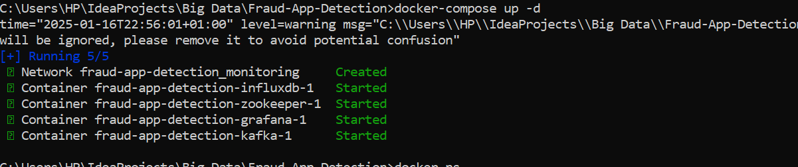
## 2. Kafka Topics
Create the necessary Kafka topics:
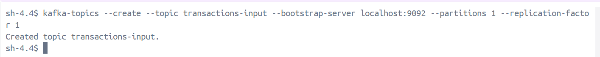

````
kafka-topics --create --topic transactions-input --bootstrap-server localhost:9092 --partitions 1 --replication-factor 1
kafka-topics --create --topic fraud-alerts --bootstrap-server localhost:9092 --partitions 1 --replication-factor 1
````
## 3. Run the Application
Start the Kafka Streams application to process transactions.
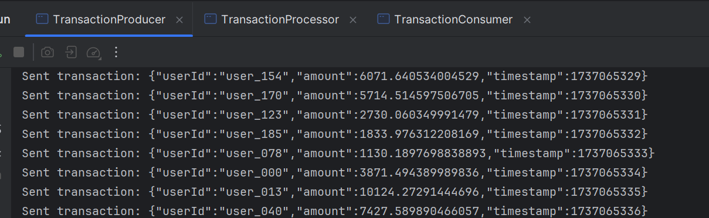
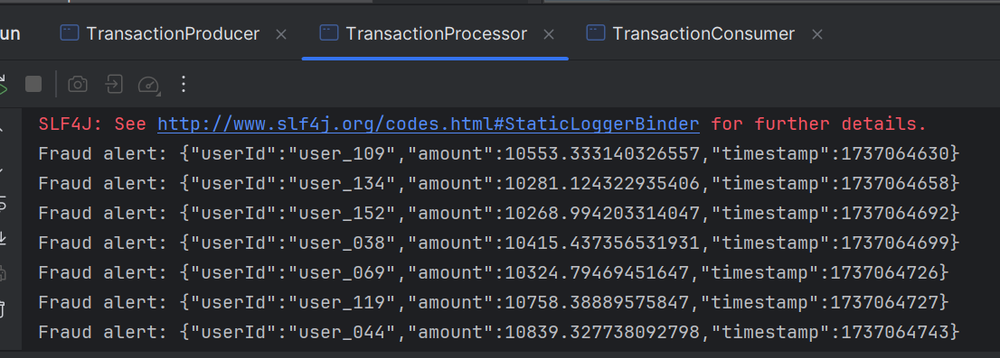
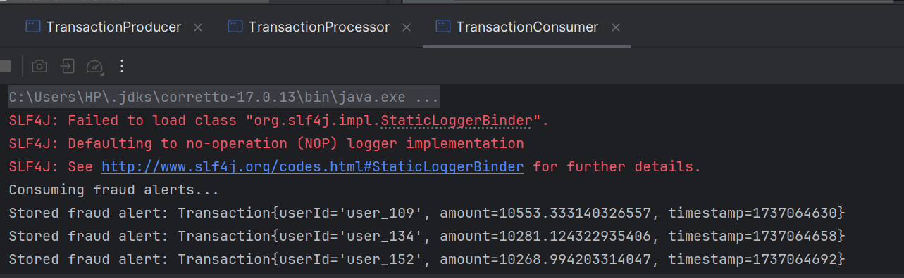
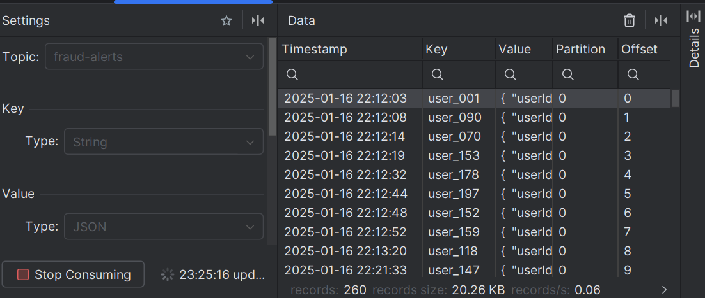

## Grafana Dashboard Setup
Connect Grafana to InfluxDB:

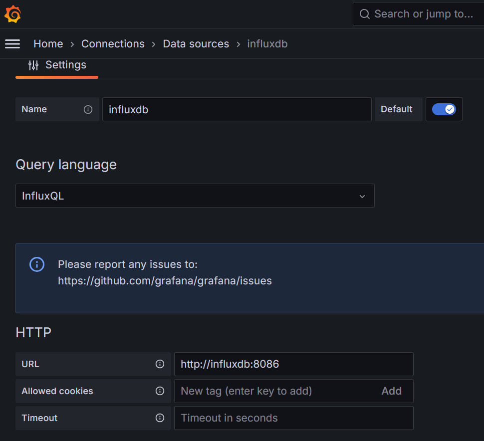
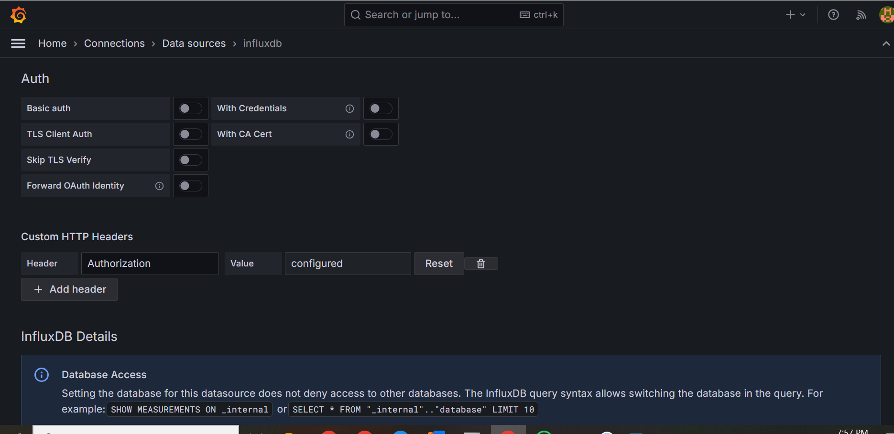
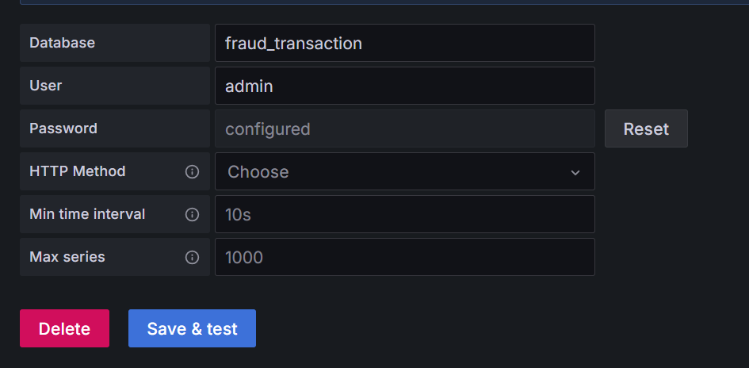
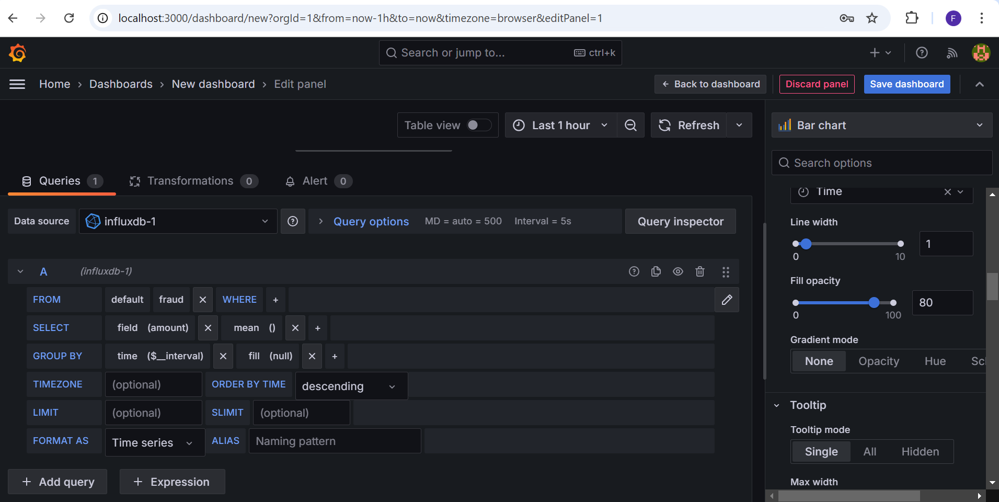


- Data Source: InfluxDB
- URL: http://influxdb:8086
- Database: Specify the database name.
- Import the provided Grafana dashboard JSON file.

Monitor real-time updates for:

Number of suspicious transactions per user
Total suspicious transaction amounts over time
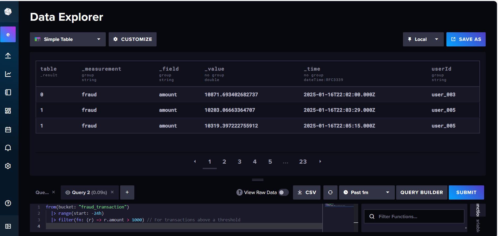
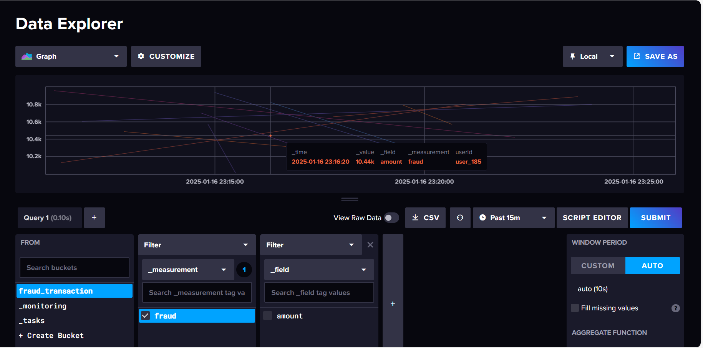
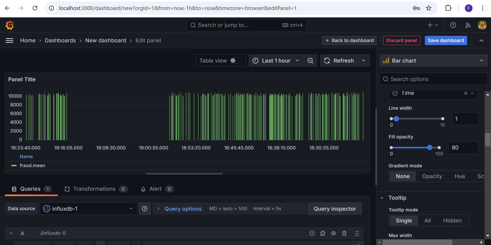


